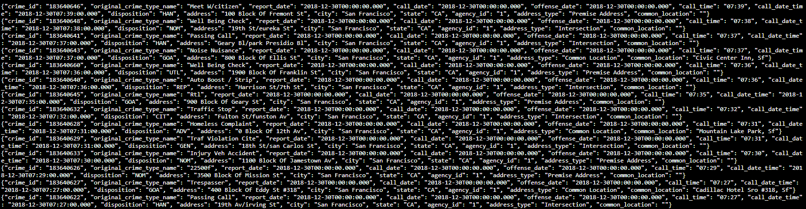
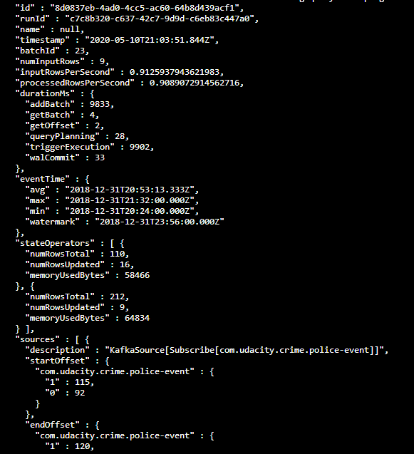
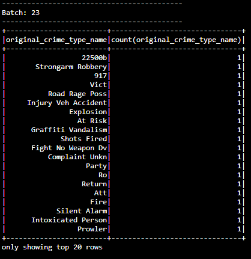

# SPARK_STREAMING_SF_Crime_Statistics

### Project Overview
In this project, you will be provided with a real-world dataset, extracted from Kaggle, on San Francisco crime incidents, and you will provide statistical analyses of the data using Apache Spark Structured Streaming. You will draw on the skills and knowledge you've learned in this course to create a Kafka server to produce data, and ingest data through Spark Structured Streaming.

### Development Environment
You may choose to create your project in the workspace we provide here, or if you wish to develop your project locally, you will need to set up your environment properly as described below:

Spark 2.4.3
Scala 2.11.x
Java 1.8.x
Kafka build with Scala 2.11.x
Python 3.6.x or 3.7.x

### Beginning the Project
This project requires creating topics, starting Zookeeper and Kafka servers, and your Kafka bootstrap server. You’ll need to choose a port number (e.g., 9092, 9093..) for your Kafka topic, and come up with a Kafka topic name and modify the zookeeper.properties and server.properties appropriately.

#### Local Environment
> Install requirements using ./start.sh if you use conda for Python. If you use pip rather than conda, then use pip install -r requirements.txt.

> Use the commands below to start the Zookeeper and Kafka servers. You can find the bin and config folder in the Kafka binary that you have downloaded and unzipped.

bin/zookeeper-server-start.sh config/zookeeper.properties
bin/kafka-server-start.sh config/server.properties

> You can start the bootstrap server using this Python command: python producer_server.py.

#### Workspace Environment

> Modify the zookeeper.properties and producer.properties given to suit your topic and port number of your choice. Start up these servers in the terminal using the commands:
/usr/bin/zookeeper-server-start zookeeper.properties
/usr/bin/kafka-server-start producer.properties

> You’ll need to open up two terminal tabs to execute each command.

> Install requirements using the provided ./start.sh script. This needs to be done every time you re-open the workspace, or anytime after you've refreshed, or woken up, or reset data, or used the "Get New Content" button in this workspace.

> In the terminal, to install other packages that you think are necessary to complete the project, use conda install <package_name>. You may need to reinstall these packages every time you re-open the workspace, or anytime after you've refreshed, or woken up, or reset data, or used the "Get New Content" button in this workspace.

### Step 1
> The first step is to build a simple Kafka server.

#### Local Environment
> To see if you correctly implemented the server, use the command bin/kafka-console-consumer.sh --bootstrap-server localhost:<your-port-number> --topic <your-topic-name> --from-beginning to see your output.

#### Workspace Environment
> To start kafka-consumer-console, use the command /usr/bin/kafka-consumer-console.
Take a screenshot of your kafka-consumer-console output. You will need to include this screenshot as part of your project submission.

Kafka Consumer Console Output

### Step 2
> Apache Spark already has an integration with Kafka brokers, so we would not normally need a separate Kafka consumer. However, we are going to ask you to create one anyway. Why? We'd like you to create the consumer to demonstrate your understanding of creating a complete Kafka Module (producer and consumer) from scratch. In production, you might have to create a dummy producer or consumer to just test out your theory and this will be great practice for that.

> Implement all the TODO items in data_stream.py. You may need to explore the dataset beforehand using a Jupyter Notebook.

> Do a spark-submit using this command: 
spark-submit --packages org.apache.spark:spark-sql-kafka-0-10_2.11:2.3.4 --master local[*] data_stream.py

> Take a screenshot of your progress reporter after executing a Spark job. 
Progress reporter 

> Take a screenshot of the Spark Streaming UI as the streaming continues. 

#### How did changing values on the SparkSession property parameters affect the throughput and latency of the data?
It mainly affected processedRowsPerSecond by either decreasing it or increasing it. In other words, it directly influenced the 
rate which Spark is processing data

#### What were the 2-3 most efficient SparkSession property key/value pairs? Through testing multiple variations on values, how can you tell these were the most optimal?

The 2 most efficient SparkSession property key/value pairs was

spark.streaming.kafka.maxRatePerPartition   10
spark.default.parallelism                   10000

processedRowsPerSecond  was used to test for a highest throughput.

